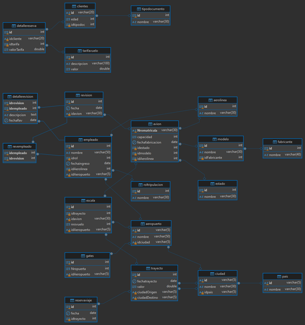

# Modelo Conceptual

## Entidades y Atributos

1. **Pais**
   - id (PK)
   - nombre

2. **Ciudad**
   - id (PK)
   - nombre
   - idpais (FK)

3. **Aeropuerto**
   - id (PK)
   - nombre
   - idciudad (FK)

4. **Gates**
   - id (PK)
   - Nropuerta
   - idAeropuerto (FK)

5. **Aerolinea**
   - id (PK)
   - nombre

6. **Fabricante**
   - id (PK)
   - nombre

7. **Modelo**
   - id (PK)
   - nombre
   - idFabricante (FK)

8. **Estado**
   - id (PK)
   - nombre

9. **Avion**
   - Nromatricula (PK)
   - capacidad
   - fechafabricacion
   - idestado (FK)
   - idmodelo (FK)
   - idAerolinea (FK)

10. **Roltripulacion**
    - id (PK)
    - nombre

11. **Empleado**
    - id (PK)
    - nombre
    - idrol (FK)
    - fechaingreso
    - idAerolinea (FK)
    - idAeropuerto (FK)

12. **Revision**
    - id (PK)
    - fecha
    - idavion (FK)

13. **Revempleado**
    - idempleado (FK)
    - idrevision (FK)

14. **DetalleRevision**
    - idrevision (FK)
    - descripcion
    - fechaRev
    - idempleado (FK)

15. **Trayecto**
    - id (PK)
    - fechatrayecto
    - valor
    - ciudadOrigen (FK)
    - ciudadDestino (FK)

16. **Escala**
    - id (PK)
    - idtrayecto (FK)
    - idavion (FK)
    - nrovuelo
    - idAeropuerto (FK)

17. **TipoDocumento**
    - id (PK)
    - nombre

18. **Clientes**
    - id (PK)
    - edad
    - idtipodoc (FK)

19. **ReservaViaje**
    - id (PK)
    - fecha
    - idtrayecto (FK)

20. **TarifaVuelo**
    - id (PK)
    - descripcion
    - valor

21. **DetalleReserva**
    - id (PK)
    - idcliente (FK)
    - idtarifa (FK)
    - valorTarifa

## Relaciones

- **Pais** tiene muchas **Ciudad** (1:N)
- **Ciudad** tiene muchos **Aeropuerto** (1:N)
- **Aeropuerto** tiene muchos **Gates** (1:N)
- **Aerolinea** tiene muchos **Avion** (1:N)
- **Fabricante** tiene muchos **Modelo** (1:N)
- **Modelo** tiene muchos **Avion** (1:N)
- **Estado** tiene muchos **Avion** (1:N)
- **Aerolinea** tiene muchos **Empleado** (1:N)
- **Roltripulacion** tiene muchos **Empleado** (1:N)
- **Avion** tiene muchas **Revision** (1:N)
- **Revision** tiene muchos **Revempleado** (M:N)
- **Revision** tiene muchos **DetalleRevision** (1:N)
- **Ciudad** tiene muchos **Trayecto** como ciudad de origen y destino (1:N)
- **Trayecto** tiene muchas **Escala** (1:N)
- **Avion** tiene muchas **Escala** (1:N)
- **Aeropuerto** tiene muchas **Escala** (1:N)
- **TipoDocumento** tiene muchos **Clientes** (1:N)
- **Clientes** tiene muchas **DetalleReserva** (1:N)
- **Trayecto** tiene muchas **ReservaViaje** (1:N)
- **TarifaVuelo** tiene muchos **DetalleReserva** (1:N)

---

# Modelo Lógico

## Tablas y Atributos

1. **Pais**
   - id: `VARCHAR(5)` (PK)
   - nombre: `VARCHAR(30)`

2. **Ciudad**
   - id: `VARCHAR(5)` (PK)
   - nombre: `VARCHAR(30)`
   - idpais: `VARCHAR(5)` (FK) → **Pais(id)**

3. **Aeropuerto**
   - id: `VARCHAR(5)` (PK)
   - nombre: `VARCHAR(50)`
   - idciudad: `VARCHAR(5)` (FK) → **Ciudad(id)**

4. **Gates**
   - id: `INT` (PK, AUTO_INCREMENT)
   - Nropuerta: `INT`
   - idAeropuerto: `VARCHAR(5)` (FK) → **Aeropuerto(id)**

5. **Aerolinea**
   - id: `INT` (PK, AUTO_INCREMENT)
   - nombre: `VARCHAR(30)`

6. **Fabricante**
   - id: `INT` (PK, AUTO_INCREMENT)
   - nombre: `VARCHAR(40)`

7. **Modelo**
   - id: `INT` (PK, AUTO_INCREMENT)
   - nombre: `VARCHAR(30)`
   - idFabricante: `INT` (FK) → **Fabricante(id)**

8. **Estado**
   - id: `INT` (PK, AUTO_INCREMENT)
   - nombre: `VARCHAR(30)`

9. **Avion**
   - Nromatricula: `VARCHAR(30)` (PK, UNIQUE)
   - capacidad: `INT`
   - fechafabricacion: `DATE`
   - idestado: `INT` (FK) → **Estado(id)**
   - idmodelo: `INT` (FK) → **Modelo(id)**
   - idAerolinea: `INT` (FK) → **Aerolinea(id)**

10. **Roltripulacion**
    - id: `INT` (PK, AUTO_INCREMENT)
    - nombre: `VARCHAR(30)`

11. **Empleado**
    - id: `INT` (PK, AUTO_INCREMENT)
    - nombre: `VARCHAR(50)`
    - idrol: `INT` (FK) → **Roltripulacion(id)**
    - fechaingreso: `DATE`
    - idAerolinea: `INT` (FK) → **Aerolinea(id)**
    - idAeropuerto: `VARCHAR(5)` (FK) → **Aeropuerto(id)**

12. **Revision**
    - id: `INT` (PK, AUTO_INCREMENT)
    - fecha: `DATE`
    - idavion: `VARCHAR(30)` (FK) → **Avion(Nromatricula)**

13. **Revempleado**
    - idempleado: `INT` (FK) → **Empleado(id)**
    - idrevision: `INT` (FK) → **Revision(id)**
    - PRIMARY KEY (idempleado, idrevision)

14. **DetalleRevision**
    - idrevision: `INT` (FK) → **Revision(id)**
    - descripcion: `TEXT`
    - fechaRev: `DATE`
    - idempleado: `INT` (FK) → **Empleado(id)**
    - PRIMARY KEY (idrevision, idempleado)

15. **Trayecto**
    - id: `INT` (PK, AUTO_INCREMENT)
    - fechatrayecto: `DATE`
    - valor: `DOUBLE`
    - ciudadOrigen: `VARCHAR(5)` (FK) → **Ciudad(id)**
    - ciudadDestino: `VARCHAR(5)` (FK) → **Ciudad(id)**

16. **Escala**
    - id: `INT` (PK, AUTO_INCREMENT)
    - idtrayecto: `INT` (FK) → **Trayecto(id)**
    - idavion: `VARCHAR(30)` (FK) → **Avion(Nromatricula)**
    - nrovuelo: `INT`
    - idAeropuerto: `VARCHAR(5)` (FK) → **Aeropuerto(id)**

17. **TipoDocumento**
    - id: `INT` (PK, AUTO_INCREMENT)
    - nombre: `VARCHAR(30)`

18. **Clientes**
    - id: `VARCHAR(20)` (PK)
    - edad: `INT`
    - idtipodoc: `INT` (FK) → **TipoDocumento(id)**

19. **ReservaViaje**
    - id: `INT` (PK, AUTO_INCREMENT)
    - fecha: `DATE`
    - idtrayecto: `INT` (FK) → **Trayecto(id)**

20. **TarifaVuelo**
    - id: `INT` (PK, AUTO_INCREMENT)
    - descripcion: `VARCHAR(50)`
    - valor: `DOUBLE`

21. **DetalleReserva**
    - id: `INT` (PK, AUTO_INCREMENT)
    - idcliente: `VARCHAR(20)` (FK) → **Clientes(id)**
    - idtarifa: `INT` (FK) → **TarifaVuelo(id)**
    - valorTarifa: `DOUBLE`

# Modelo Fisico
```sql
CREATE TABLE Pais (
    id VARCHAR(5) PRIMARY KEY,
    nombre VARCHAR(30)
);
```

```sql
CREATE TABLE Ciudad (
    id VARCHAR(5) PRIMARY KEY,
    nombre VARCHAR(30),
    idpais VARCHAR(5),
    FOREIGN KEY (idpais) REFERENCES Pais(id)
);
```

```sql
CREATE TABLE Aeropuerto (
    id VARCHAR(5) PRIMARY KEY,
    nombre VARCHAR(50),
    idciudad VARCHAR(5),
    FOREIGN KEY (idciudad) REFERENCES Ciudad(id)
);
```

```sql
CREATE TABLE Gates (
    id INT AUTO_INCREMENT PRIMARY KEY,
    Nropuerta INT,
    idAeropuerto VARCHAR(5),
    FOREIGN KEY (idAeropuerto) REFERENCES Aeropuerto(id)
);
```

```sql
CREATE TABLE Aerolinea (
    id INT AUTO_INCREMENT PRIMARY KEY,
    nombre VARCHAR(30)
);
```

```sql
CREATE TABLE Fabricante (
    id INT AUTO_INCREMENT PRIMARY KEY,
    nombre VARCHAR(40)
);
```

```sql
CREATE TABLE Modelo (
    id INT AUTO_INCREMENT PRIMARY KEY,
    nombre VARCHAR(30),
    idFabricante INT,
    FOREIGN KEY (idFabricante) REFERENCES Fabricante(id)
);
```

```sql
CREATE TABLE Estado (
    id INT AUTO_INCREMENT PRIMARY KEY,
    nombre VARCHAR(30)
);
```
```sql
CREATE TABLE Avion (
    Nromatricula VARCHAR(30) UNIQUE PRIMARY KEY,
    capacidad INT,
    fechafabricacion DATE,
    idestado INT,
    idmodelo INT,
    idAerolinea INT,
    FOREIGN KEY (idestado) REFERENCES Estado(id),
    FOREIGN KEY (idmodelo) REFERENCES Modelo(id),
    FOREIGN KEY (idAerolinea) REFERENCES Aerolinea(id)
);
```

```sql
CREATE TABLE Roltripulacion (
    id INT AUTO_INCREMENT PRIMARY KEY,
    nombre VARCHAR(30)
);
```

```sql
CREATE TABLE Empleado (
    id INT AUTO_INCREMENT PRIMARY KEY,
    nombre VARCHAR(50),
    idrol INT,
    fechaingreso DATE,
    idAerolinea INT,
    idAeropuerto VARCHAR(5),
    FOREIGN KEY (idrol) REFERENCES Roltripulacion(id),
    FOREIGN KEY (idAerolinea) REFERENCES Aerolinea(id),
    FOREIGN KEY (idAeropuerto) REFERENCES Aeropuerto(id)
);
```

```sql
CREATE TABLE Revision (
    id INT AUTO_INCREMENT PRIMARY KEY,
    fecha DATE,
    idavion VARCHAR(30),
    FOREIGN KEY (idavion) REFERENCES Avion(Nromatricula)
);
```

```sql
CREATE TABLE Revempleado (
    idempleado INT,
    idrevision INT,
    PRIMARY KEY (idempleado, idrevision),
    FOREIGN KEY (idempleado) REFERENCES Empleado(id),
    FOREIGN KEY (idrevision) REFERENCES Revision(id)
);
```

```sql
CREATE TABLE DetalleRevision (
    idrevision INT,
    descripcion TEXT,
    fechaRev DATE,
    idempleado INT,
    PRIMARY KEY (idrevision, idempleado),
    FOREIGN KEY (idrevision) REFERENCES Revision(id),
    FOREIGN KEY (idempleado) REFERENCES Empleado(id)
);
```

```sql
CREATE TABLE Trayecto (
    id INT AUTO_INCREMENT PRIMARY KEY,
    fechatrayecto DATE,
    valor DOUBLE,
    ciudadOrigen VARCHAR(5),
    ciudadDestino VARCHAR(5),
    FOREIGN KEY (ciudadOrigen) REFERENCES Ciudad(id),
    FOREIGN KEY (ciudadDestino) REFERENCES Ciudad(id)
);
``` 

```sql
CREATE TABLE Escala (
    id INT AUTO_INCREMENT PRIMARY KEY,
    idtrayecto INT,
    idavion VARCHAR(30),
    nrovuelo INT,
    idAeropuerto VARCHAR(5),
    FOREIGN KEY (idtrayecto) REFERENCES Trayecto(id),
    FOREIGN KEY (idavion) REFERENCES Avion(Nromatricula),
    FOREIGN KEY (idAeropuerto) REFERENCES Aeropuerto(id)
);
```

```sql
CREATE TABLE TipoDocumento (
    id INT AUTO_INCREMENT PRIMARY KEY,
    nombre VARCHAR(30)
);
```

```sql
CREATE TABLE Clientes (
    id VARCHAR(20) PRIMARY KEY,
    edad INT,
    idtipodoc INT,
    FOREIGN KEY (idtipodoc) REFERENCES TipoDocumento(id)
);
```

```sql
CREATE TABLE ReservaViaje (
    id INT AUTO_INCREMENT PRIMARY KEY,
    fecha DATE,
    idtrayecto INT,
    FOREIGN KEY (idtrayecto) REFERENCES Trayecto(id)
);
```

```sql
CREATE TABLE TarifaVuelo (
    id INT AUTO_INCREMENT PRIMARY KEY,
    descripcion VARCHAR(100),
    valor DOUBLE
);
```

```sql
CREATE TABLE DetalleReserva (
    id INT AUTO_INCREMENT PRIMARY KEY,
    idcliente VARCHAR(20),
    idtarifa INT,
    valorTarifa DOUBLE,
    FOREIGN KEY (idcliente) REFERENCES Clientes(id),
    FOREIGN KEY (idtarifa) REFERENCES TarifaVuelo(id)
);
```
