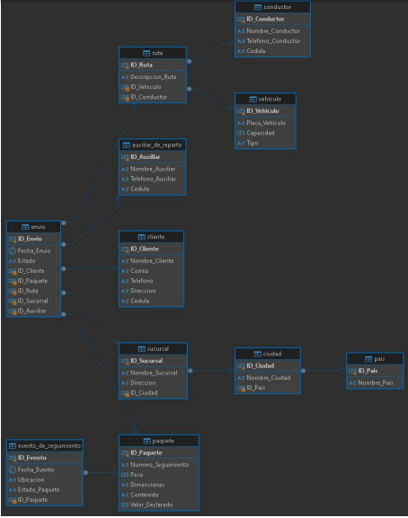

# Modelo Conceptual

1. **Pais**
   - ID_Pais (PK)
   - Nombre_Pais

2. **Ciudad**
   - ID_Ciudad (PK)
   - Nombre_Ciudad
   - ID_Pais (FK)

3. **Sucursal**
   - ID_Sucursal (PK)
   - Nombre_Sucursal
   - Direccion
   - ID_Ciudad (FK)

4. **Cliente**
   - ID_Cliente (PK)
   - Nombre_Cliente
   - Correo
   - Telefono
   - Direccion
   - Cedula

5. **Paquete**
   - ID_Paquete (PK)
   - Numero_Seguimiento
   - Peso
   - Dimensiones
   - Contenido
   - Valor_Declarado

6. **Vehiculo**
   - ID_Vehiculo (PK)
   - Placa_Vehiculo
   - Capacidad
   - Tipo

7. **Conductor**
   - ID_Conductor (PK)
   - Nombre_Conductor
   - Telefono_Conductor
   - Cedula

8. **Ruta**
   - ID_Ruta (PK)
   - Descripcion_Ruta
   - ID_Vehiculo (FK)
   - ID_Conductor (FK)

9. **Auxiliar de Reparto**
   - ID_Auxiliar (PK)
   - Nombre_Auxiliar
   - Telefono_Auxiliar
   - Cedula

10. **Envio**
    - ID_Envio (PK)
    - Fecha_Envio
    - Estado
    - ID_Cliente (FK)
    - ID_Paquete (FK)
    - ID_Ruta (FK)
    - ID_Sucursal (FK)
    - ID_Auxiliar (FK)

11. **Evento de Seguimiento**
    - ID_Evento (PK)
    - Fecha_Evento
    - Ubicacion
    - Estado_Paquete
    - ID_Paquete (FK)

### Relaciones
- Un **País** tiene muchas **Ciudades**
- Una **Ciudad** pertenece a un **País**
- Una **Ciudad** tiene muchas **Sucursales**
- Una **Sucursal** está en una **Ciudad**
- Un **Cliente** puede tener muchos **Envíos**
- Un **Paquete** está asociado a un **Envío**
- Una **Ruta** puede tener un **Vehículo** y un **Conductor**
- Un **Envío** está asociado a una **Ruta**, una **Sucursal** y puede tener un **Auxiliar de Reparto**
- Un **Paquete** puede tener muchos **Eventos de Seguimiento**

---

# Modelo Lógico

1. **Pais**  
   `(ID_Pais INT PK, Nombre_Pais VARCHAR(100))`

2. **Ciudad**  
   `(ID_Ciudad INT PK, Nombre_Ciudad VARCHAR(100), ID_Pais INT FK -> Pais.ID_Pais)`

3. **Sucursal**  
   `(ID_Sucursal INT PK, Nombre_Sucursal VARCHAR(100), Direccion VARCHAR(255), ID_Ciudad INT FK -> Ciudad.ID_Ciudad)`

4. **Cliente**  
   `(ID_Cliente INT PK, Nombre_Cliente VARCHAR(100), Correo VARCHAR(100), Telefono VARCHAR(20), Direccion VARCHAR(255), Cedula VARCHAR(20))`

5. **Paquete**  
   `(ID_Paquete INT PK, Numero_Seguimiento VARCHAR(50), Peso DECIMAL(10,2), Dimensiones VARCHAR(50), Contenido VARCHAR(255), Valor_Declarado DECIMAL(10,2))`

6. **Vehiculo**  
   `(ID_Vehiculo INT PK, Placa_Vehiculo VARCHAR(20), Capacidad DECIMAL(10,2), Tipo VARCHAR(50))`

7. **Conductor**  
   `(ID_Conductor INT PK, Nombre_Conductor VARCHAR(100), Telefono_Conductor VARCHAR(20), Cedula VARCHAR(20))`

8. **Ruta**  
   `(ID_Ruta INT PK, Descripcion_Ruta VARCHAR(255), ID_Vehiculo INT FK -> Vehiculo.ID_Vehiculo, ID_Conductor INT FK -> Conductor.ID_Conductor)`

9. **Auxiliar de Reparto**  
   `(ID_Auxiliar INT PK, Nombre_Auxiliar VARCHAR(100), Telefono_Auxiliar VARCHAR(20), Cedula VARCHAR(20))`

10. **Envio**  
    `(ID_Envio INT PK, Fecha_Envio DATE, Estado VARCHAR(50), ID_Cliente INT FK -> Cliente.ID_Cliente, ID_Paquete INT FK -> Paquete.ID_Paquete, ID_Ruta INT FK -> Ruta.ID_Ruta, ID_Sucursal INT FK -> Sucursal.ID_Sucursal, ID_Auxiliar INT FK -> Auxiliar_de_Reparto.ID_Auxiliar)`

11. **Evento de Seguimiento**  
    `(ID_Evento INT PK, Fecha_Evento DATE, Ubicacion VARCHAR(255), Estado_Paquete VARCHAR(50), ID_Paquete INT FK -> Paquete.ID_Paquete)`

# Modelo Fisico

```sql
CREATE DATABASE envio;
USE envio;
```

```sql
CREATE TABLE Pais (
    ID_Pais INT AUTO_INCREMENT,
    Nombre_Pais VARCHAR(100) NOT NULL,
    PRIMARY KEY (ID_Pais)
);
```

```sql
CREATE TABLE Ciudad (
    ID_Ciudad INT AUTO_INCREMENT,
    Nombre_Ciudad VARCHAR(100) NOT NULL,
    ID_Pais INT,
    PRIMARY KEY (ID_Ciudad),
    CONSTRAINT FK_Ciudad_Pais FOREIGN KEY (ID_Pais) REFERENCES Pais(ID_Pais)
);
```

```sql
CREATE TABLE Sucursal (
    ID_Sucursal INT AUTO_INCREMENT,
    Nombre_Sucursal VARCHAR(100) NOT NULL,
    Direccion VARCHAR(255) NOT NULL,
    ID_Ciudad INT,
    PRIMARY KEY (ID_Sucursal),
    CONSTRAINT FK_Sucursal_Ciudad FOREIGN KEY (ID_Ciudad) REFERENCES Ciudad(ID_Ciudad)
);
```

```sql
CREATE TABLE Cliente (
    ID_Cliente INT AUTO_INCREMENT,
    Nombre_Cliente VARCHAR(100) NOT NULL,
    Correo VARCHAR(100) NOT NULL,
    Telefono VARCHAR(20),
    Direccion VARCHAR(255),
    Cedula VARCHAR(20) NOT NULL,
    PRIMARY KEY (ID_Cliente)
);
```

```sql
CREATE TABLE Paquete (
    ID_Paquete INT AUTO_INCREMENT,
    Numero_Seguimiento VARCHAR(50) NOT NULL,
    Peso DECIMAL(10, 2),
    Dimensiones VARCHAR(50),
    Contenido VARCHAR(255),
    Valor_Declarado DECIMAL(10, 2),
    PRIMARY KEY (ID_Paquete)
);
```

```sql
CREATE TABLE Vehiculo (
    ID_Vehiculo INT AUTO_INCREMENT,
    Placa_Vehiculo VARCHAR(20) NOT NULL,
    Capacidad DECIMAL(10, 2),
    Tipo VARCHAR(50),
    PRIMARY KEY (ID_Vehiculo)
);
```

```sql
CREATE TABLE Conductor (
    ID_Conductor INT AUTO_INCREMENT,
    Nombre_Conductor VARCHAR(100) NOT NULL,
    Telefono_Conductor VARCHAR(20),
    Cedula VARCHAR(20) NOT NULL,
    PRIMARY KEY (ID_Conductor)
);
```

```sql
CREATE TABLE Ruta (
    ID_Ruta INT AUTO_INCREMENT,
    Descripcion_Ruta VARCHAR(255) NOT NULL,
    ID_Vehiculo INT,
    ID_Conductor INT,
    PRIMARY KEY (ID_Ruta),
    CONSTRAINT FK_Ruta_Vehiculo FOREIGN KEY (ID_Vehiculo) REFERENCES Vehiculo(ID_Vehiculo),
    CONSTRAINT FK_Ruta_Conductor FOREIGN KEY (ID_Conductor) REFERENCES Conductor(ID_Conductor)
);
```

```sql
CREATE TABLE Auxiliar_de_Reparto (
    ID_Auxiliar INT AUTO_INCREMENT,
    Nombre_Auxiliar VARCHAR(100) NOT NULL,
    Telefono_Auxiliar VARCHAR(20),
    Cedula VARCHAR(20) NOT NULL,
    PRIMARY KEY (ID_Auxiliar)
);
```

```sql
CREATE TABLE Envio (
    ID_Envio INT AUTO_INCREMENT,
    Fecha_Envio DATE NOT NULL,
    Estado VARCHAR(50),
    ID_Cliente INT,
    ID_Paquete INT,
    ID_Ruta INT,
    ID_Sucursal INT,
    ID_Auxiliar INT,
    PRIMARY KEY (ID_Envio),
    CONSTRAINT FK_Envio_Cliente FOREIGN KEY (ID_Cliente) REFERENCES Cliente(ID_Cliente),
    CONSTRAINT FK_Envio_Paquete FOREIGN KEY (ID_Paquete) REFERENCES Paquete(ID_Paquete),
    CONSTRAINT FK_Envio_Ruta FOREIGN KEY (ID_Ruta) REFERENCES Ruta(ID_Ruta),
    CONSTRAINT FK_Envio_Sucursal FOREIGN KEY (ID_Sucursal) REFERENCES Sucursal(ID_Sucursal),
    CONSTRAINT FK_Envio_Auxiliar FOREIGN KEY (ID_Auxiliar) REFERENCES Auxiliar_de_Reparto(ID_Auxiliar)
);
```

```sql
CREATE TABLE Evento_de_Seguimiento (
    ID_Evento INT AUTO_INCREMENT,
    Fecha_Evento DATE NOT NULL,
    Ubicacion VARCHAR(255) NOT NULL,
    Estado_Paquete VARCHAR(50),
    ID_Paquete INT,
    PRIMARY KEY (ID_Evento),
    CONSTRAINT FK_Evento_Paquete FOREIGN KEY (ID_Paquete) REFERENCES Paquete(ID_Paquete)
);
```

- Inserción de datos en las tablas

```sql
INSERT INTO Pais (Nombre_Pais) VALUES
('Colombia'),
('México'),
('Argentina');
```

```sql
INSERT INTO Ciudad (Nombre_Ciudad, ID_Pais) VALUES
('Bogotá', 1),
('Ciudad de México', 2),
('Buenos Aires', 3);
```

```sql
INSERT INTO Sucursal (Nombre_Sucursal, Direccion, ID_Ciudad) VALUES
('Sucursal Centro', 'Calle 50 #20-30', 1),
('Sucursal Norte', 'Av. Insurgentes 300', 2),
('Sucursal Sur', 'Av. 9 de Julio 1000', 3);
```

```sql
INSERT INTO Cliente (Nombre_Cliente, Correo, Telefono, Direccion, Cedula) VALUES
('Juan Pérez', 'juan@email.com', '1234567890', 'Calle 10 #5-15', '1001002000'),
('María López', 'maria@email.com', '0987654321', 'Av. Principal 123', '2002003000'),
('Carlos Rodríguez', 'carlos@email.com', '5556667777', 'Carrera 15 #30-45', '3003004000');
```

```sql
INSERT INTO Paquete (Numero_Seguimiento, Peso, Dimensiones, Contenido, Valor_Declarado) VALUES
('PKT001', 5.5, '30x20x15', 'Libros', 100.00),
('PKT002', 2.0, '15x10x5', 'Ropa', 50.00),
('PKT003', 10.0, '50x40x30', 'Electrónicos', 500.00);
```

```sql
INSERT INTO Vehiculo (Placa_Vehiculo, Capacidad, Tipo) VALUES
('ABC123', 1000.00, 'Camión'),
('XYZ789', 500.00, 'Furgoneta'),
('DEF456', 200.00, 'Automóvil');
```

```sql
INSERT INTO Conductor (Nombre_Conductor, Telefono_Conductor, Cedula) VALUES
('Pedro Gómez', '1112223333', '4004005000'),
('Ana Martínez', '4445556666', '5005006000'),
('Luis Torres', '7778889999', '6006007000');
```

```sql
INSERT INTO Ruta (Descripcion_Ruta, ID_Vehiculo, ID_Conductor) VALUES
('Ruta Norte', 1, 1),
('Ruta Centro', 2, 2),
('Ruta Sur', 3, 3);
```

```sql
INSERT INTO Auxiliar_de_Reparto (Nombre_Auxiliar, Telefono_Auxiliar, Cedula) VALUES
('Sofía Ramírez', '2223334444', '7007008000'),
('Diego Vargas', '5556667777', '8008009000'),
('Laura Castro', '8889990000', '9009000000');
```

```sql
INSERT INTO Envio (Fecha_Envio, Estado, ID_Cliente, ID_Paquete, ID_Ruta, ID_Sucursal, ID_Auxiliar) VALUES
('2023-05-01', 'En tránsito', 1, 1, 1, 1, 1),
('2023-05-02', 'Entregado', 2, 2, 2, 2, 2),
('2023-05-03', 'En proceso', 3, 3, 3, 3, 3);
```

```sql
INSERT INTO Evento_de_Seguimiento (Fecha_Evento, Ubicacion, Estado_Paquete, ID_Paquete) VALUES
('2023-05-01', 'Centro de distribución', 'Recibido', 1),
('2023-05-02', 'En ruta', 'En tránsito', 2),
('2023-05-03', 'Domicilio del cliente', 'Entregado', 3);
```

```sql
3. Registrar un nuevo teléfono para un cliente:
UPDATE Cliente SET Telefono = '9988776655' WHERE ID_Cliente = 1;
```

```sql
4. Registrar un nuevo paquete:
INSERT INTO Paquete (Numero_Seguimiento, Peso, Dimensiones, Contenido, Valor_Declarado) VALUES
('PKT004', 3.5, '25x15x10', 'Documentos', 75.00);
```

```sql
5. Registrar un nuevo envío:
INSERT INTO Envio (Fecha_Envio, Estado, ID_Cliente, ID_Paquete, ID_Ruta, ID_Sucursal, ID_Auxiliar) VALUES
(CURDATE(), 'En proceso', 1, 4, 1, 1, 1);
```

```sql
6. Registrar un nuevo vehículo:
INSERT INTO Vehiculo (Placa_Vehiculo, Capacidad, Tipo) VALUES
('GHI789', 750.00, 'Camioneta');
```

```sql
7. Registrar un nuevo conductor:
INSERT INTO Conductor (Nombre_Conductor, Telefono_Conductor, Cedula) VALUES
('Roberto Sánchez', '3334445555', '7007008000');
```

```sql
8. Registrar un nuevo teléfono para un conductor:
UPDATE Conductor SET Telefono_Conductor = '6667778888' WHERE ID_Conductor = 1;
```

```sql
9. Asignar un conductor a una ruta y un vehículo:
UPDATE Ruta SET ID_Conductor = 4, ID_Vehiculo = 4 WHERE ID_Ruta = 1;
```

```sql
10. Registrar un nuevo auxiliar:
INSERT INTO Auxiliar_de_Reparto (Nombre_Auxiliar, Telefono_Auxiliar, Cedula) VALUES
('Elena Gómez', '9990001111', '1010101010');
```

```sql
11. Asignar un auxiliar a una ruta:
UPDATE Envio SET ID_Auxiliar = 4 WHERE ID_Ruta = 1;
```

```sql
12. Registrar un evento de seguimiento para un paquete:
INSERT INTO Evento_de_Seguimiento (Fecha_Evento, Ubicacion, Estado_Paquete, ID_Paquete) VALUES
(CURDATE(), 'Centro de clasificación', 'En tránsito', 4);
```

```sql
13. Generar un reporte de envíos por cliente:
SELECT e.*, p.Numero_Seguimiento, p.Contenido
FROM Envio e
JOIN Paquete p ON e.ID_Paquete = p.ID_Paquete
WHERE e.ID_Cliente = 1;
```

```sql
14. Actualizar el estado de un paquete:
UPDATE Paquete SET Estado = 'Entregado' WHERE ID_Paquete = 1;
```

```sql
15. Rastrear la ubicación actual de un paquete:
SELECT * FROM Evento_de_Seguimiento
WHERE ID_Paquete = 1
ORDER BY Fecha_Evento DESC
LIMIT 1;  
```



## Casos Multitabla

1. Obtener Información Completa de Envíos:
```sql
SELECT e.*, c.Nombre_Cliente, p.Numero_Seguimiento, r.Descripcion_Ruta,
       con.Nombre_Conductor, s.Nombre_Sucursal
FROM Envio e
JOIN Cliente c ON e.ID_Cliente = c.ID_Cliente
JOIN Paquete p ON e.ID_Paquete = p.ID_Paquete
JOIN Ruta r ON e.ID_Ruta = r.ID_Ruta
JOIN Conductor con ON r.ID_Conductor = con.ID_Conductor
JOIN Sucursal s ON e.ID_Sucursal = s.ID_Sucursal;
```

2. Obtener Historial de Envíos de un Cliente:
```sql
SELECT e.*, p.Numero_Seguimiento, p.Contenido, es.Fecha_Evento,
       es.Estado_Paquete
FROM Envio e
JOIN Paquete p ON e.ID_Paquete = p.ID_Paquete
LEFT JOIN Evento_de_Seguimiento es ON p.ID_Paquete = es.ID_Paquete
WHERE e.ID_Cliente = 1
ORDER BY e.Fecha_Envio DESC, es.Fecha_Evento DESC;
```

3. Listar Conductores y sus Rutas Asignadas:
```sql
SELECT c.Nombre_Conductor, r.Descripcion_Ruta, v.Placa_Vehiculo,
       s.Nombre_Sucursal
FROM Conductor c
LEFT JOIN Ruta r ON c.ID_Conductor = r.ID_Conductor
LEFT JOIN Vehiculo v ON r.ID_Vehiculo = v.ID_Vehiculo
LEFT JOIN Envio e ON r.ID_Ruta = e.ID_Ruta
LEFT JOIN Sucursal s ON e.ID_Sucursal = s.ID_Sucursal;
```

4. Obtener Detalles de Rutas y Auxiliares Asignados:
```sql
SELECT r.Descripcion_Ruta, a.Nombre_Auxiliar
FROM Ruta r
LEFT JOIN Envio e ON r.ID_Ruta = e.ID_Ruta
LEFT JOIN Auxiliar_de_Reparto a ON e.ID_Auxiliar = a.ID_Auxiliar;
```

5. Generar Reporte de Paquetes por Sucursal y Estado:
```sql
SELECT s.Nombre_Sucursal, p.Estado, COUNT(*) as Cantidad_Paquetes
FROM Sucursal s
JOIN Envio e ON s.ID_Sucursal = e.ID_Sucursal
JOIN Paquete p ON e.ID_Paquete = p.ID_Paquete
GROUP BY s.Nombre_Sucursal, p.Estado;
```

6. Obtener Información Completa de un Paquete y su Historial de Seguimiento:
```sql
SELECT p.*, e.Fecha_Envio, e.Estado as Estado_Envio,
       es.Fecha_Evento, es.Ubicacion, es.Estado_Paquete
FROM Paquete p
LEFT JOIN Envio e ON p.ID_Paquete = e.ID_Paquete
LEFT JOIN Evento_de_Seguimiento es ON p.ID_Paquete = es.ID_Paquete
WHERE p.ID_Paquete = 1
ORDER BY es.Fecha_Evento DESC;
```

## Casos de uso Between, In y Not In

```sql
1. Obtener Paquetes Enviados Dentro de un Rango de Fechas:
SELECT p.*, e.Fecha_Envio
FROM Paquete p
JOIN Envio e ON p.ID_Paquete = e.ID_Paquete
WHERE e.Fecha_Envio BETWEEN '2023-01-01' AND '2023-12-31';
```

```sql
2. Obtener Paquetes con Ciertos Estados:
SELECT *
FROM Paquete
WHERE Estado IN ('en tránsito', 'entregado');
```

```sql
3. Obtener Paquetes Excluyendo Ciertos Estados:
SELECT *
FROM Paquete
WHERE Estado NOT IN ('recibido', 'retenido en aduana');
```

```sql
4. Obtener Clientes con Envíos Realizados Dentro de un Rango de Fechas:
SELECT DISTINCT c.*
FROM Cliente c
JOIN Envio e ON c.ID_Cliente = e.ID_Cliente
WHERE e.Fecha_Envio BETWEEN '2023-01-01' AND '2023-12-31';
```

```sql
5. Obtener Conductores Disponibles que No Están Asignados a Ciertas Rutas:
SELECT *
FROM Conductor
WHERE ID_Conductor NOT IN (
 SELECT ID_Conductor
 FROM Ruta
 WHERE ID_Ruta IN (1, 2, 3)
);
```

```sql
6. Obtener Información de Paquetes con Valor Declarado Dentro de un Rango Específico:
SELECT *
FROM Paquete
WHERE Valor_Declarado BETWEEN 100.00 AND 500.00;
```

```sql
7. Obtener Auxiliares Asignados a Rutas Específicas:
SELECT DISTINCT a.*
FROM Auxiliar_de_Reparto a
JOIN Envio e ON a.ID_Auxiliar = e.ID_Auxiliar
WHERE e.ID_Ruta IN (1, 2, 3);
```

```sql
8. Obtener Envíos a Destinos Excluyendo Ciertas Ciudades:
SELECT e.*
FROM Envio e
JOIN Sucursal s ON e.ID_Sucursal = s.ID_Sucursal
JOIN Ciudad c ON s.ID_Ciudad = c.ID_Ciudad
WHERE c.ID_Ciudad NOT IN (1, 2, 3);
```

```sql
9. Obtener Seguimientos de Paquetes en un Rango de Fechas:
SELECT *
FROM Evento_de_Seguimiento
WHERE Fecha_Evento BETWEEN '2023-01-01' AND '2023-12-31';
```

```sql
10. Obtener Clientes que Tienen Ciertos Tipos de Paquetes:
SELECT DISTINCT c.*
FROM Cliente c
JOIN Envio e ON c.ID_Cliente = e.ID_Cliente
JOIN Paquete p ON e.ID_Paquete = p.ID_Paquete
WHERE p.Contenido IN ('nacional', 'internacional');
```