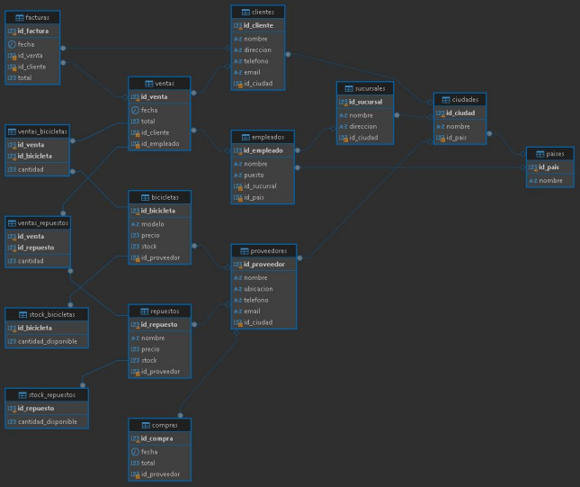

# Modelo Conceptual

## Entidades y Atributos

1. **Paises**
   - `id_pais` (PK)
   - `nombre`

2. **Ciudades**
   - `id_ciudad` (PK)
   - `nombre`
   - `id_pais` (FK)

3. **Sucursales**
   - `id_sucursal` (PK)
   - `nombre`
   - `direccion`
   - `id_ciudad` (FK)

4. **Empleados**
   - `id_empleado` (PK)
   - `nombre`
   - `puesto`
   - `id_sucursal` (FK)
   - `id_pais` (FK)

5. **Clientes**
   - `id_cliente` (PK)
   - `nombre`
   - `direccion`
   - `telefono`
   - `email`
   - `id_ciudad` (FK)

6. **Proveedores**
   - `id_proveedor` (PK)
   - `nombre`
   - `ubicacion`
   - `telefono`
   - `email`
   - `id_ciudad` (FK)

7. **Repuestos**
   - `id_repuesto` (PK)
   - `nombre`
   - `precio`
   - `stock`
   - `id_proveedor` (FK)

8. **Bicicletas**
   - `id_bicicleta` (PK)
   - `modelo`
   - `precio`
   - `stock`
   - `id_proveedor` (FK)

9. **Ventas**
   - `id_venta` (PK)
   - `fecha`
   - `total`
   - `id_cliente` (FK)
   - `id_empleado` (FK)

10. **Ventas_Bicicletas**
    - `id_venta` (FK)
    - `id_bicicleta` (FK)
    - `cantidad` (PK)

11. **Compras**
    - `id_compra` (PK)
    - `fecha`
    - `total`
    - `id_proveedor` (FK)

12. **Ventas_Repuestos**
    - `id_venta` (FK)
    - `id_repuesto` (FK)
    - `cantidad` (PK)

13. **Facturas**
    - `id_factura` (PK)
    - `fecha`
    - `id_venta` (FK)
    - `id_cliente` (FK)
    - `total`

14. **Stock_Bicicletas**
    - `id_bicicleta` (PK, FK)
    - `cantidad_disponible`

15. **Stock_Repuestos**
    - `id_repuesto` (PK, FK)
    - `cantidad_disponible`

## Relaciones

- **Paises a Ciudades:** Uno a Muchos (Un país puede tener muchas ciudades).
- **Ciudades a Sucursales:** Uno a Muchos (Una ciudad puede tener muchas sucursales).
- **Sucursales a Empleados:** Uno a Muchos (Una sucursal puede tener muchos empleados).
- **Ciudades a Clientes:** Uno a Muchos (Una ciudad puede tener muchos clientes).
- **Ciudades a Proveedores:** Uno a Muchos (Una ciudad puede tener muchos proveedores).
- **Proveedores a Repuestos:** Uno a Muchos (Un proveedor puede tener muchos repuestos).
- **Proveedores a Bicicletas:** Uno a Muchos (Un proveedor puede tener muchas bicicletas).
- **Clientes a Ventas:** Uno a Muchos (Un cliente puede tener muchas ventas).
- **Empleados a Ventas:** Uno a Muchos (Un empleado puede realizar muchas ventas).
- **Ventas a Ventas_Bicicletas:** Uno a Muchos (Una venta puede incluir muchas bicicletas).
- **Ventas a Ventas_Repuestos:** Uno a Muchos (Una venta puede incluir muchos repuestos).
- **Proveedores a Compras:** Uno a Muchos (Un proveedor puede tener muchas compras).
- **Ventas a Facturas:** Uno a Uno (Una venta puede tener una factura).
- **Clientes a Facturas:** Uno a Muchos (Un cliente puede tener muchas facturas).
- **Bicicletas a Stock_Bicicletas:** Uno a Uno (Cada bicicleta tiene un registro de stock).
- **Repuestos a Stock_Repuestos:** Uno a Uno (Cada repuesto tiene un registro de stock).

# Modelo Lógico

1. **Paises**
   - `id_pais`: INT (PK, AUTO_INCREMENT)
   - `nombre`: VARCHAR(100)

2. **Ciudades**
   - `id_ciudad`: INT (PK, AUTO_INCREMENT)
   - `nombre`: VARCHAR(100)
   - `id_pais`: INT (FK) → Referencia a Paises(`id_pais`)

3. **Sucursales**
   - `id_sucursal`: INT (PK, AUTO_INCREMENT)
   - `nombre`: VARCHAR(100)
   - `direccion`: VARCHAR(150)
   - `id_ciudad`: INT (FK) → Referencia a Ciudades(`id_ciudad`)

4. **Empleados**
   - `id_empleado`: INT (PK, AUTO_INCREMENT)
   - `nombre`: VARCHAR(100)
   - `puesto`: VARCHAR(100)
   - `id_sucursal`: INT (FK) → Referencia a Sucursales(`id_sucursal`)
   - `id_pais`: INT (FK) → Referencia a Paises(`id_pais`)

5. **Clientes**
   - `id_cliente`: INT (PK, AUTO_INCREMENT)
   - `nombre`: VARCHAR(100)
   - `direccion`: VARCHAR(150)
   - `telefono`: VARCHAR(15)
   - `email`: VARCHAR(100)
   - `id_ciudad`: INT (FK) → Referencia a Ciudades(`id_ciudad`)

6. **Proveedores**
   - `id_proveedor`: INT (PK, AUTO_INCREMENT)
   - `nombre`: VARCHAR(100)
   - `ubicacion`: VARCHAR(150)
   - `telefono`: VARCHAR(15)
   - `email`: VARCHAR(100)
   - `id_ciudad`: INT (FK) → Referencia a Ciudades(`id_ciudad`)

7. **Repuestos**
   - `id_repuesto`: INT (PK, AUTO_INCREMENT)
   - `nombre`: VARCHAR(100)
   - `precio`: DECIMAL(10, 2)
   - `stock`: INT
   - `id_proveedor`: INT (FK) → Referencia a Proveedores(`id_proveedor`)

8. **Bicicletas**
   - `id_bicicleta`: INT (PK, AUTO_INCREMENT)
   - `modelo`: VARCHAR(100)
   - `precio`: DECIMAL(10, 2)
   - `stock`: INT
   - `id_proveedor`: INT (FK) → Referencia a Proveedores(`id_proveedor`)

9. **Ventas**
   - `id_venta`: INT (PK, AUTO_INCREMENT)
   - `fecha`: DATE
   - `total`: DECIMAL(10, 2)
   - `id_cliente`: INT (FK) → Referencia a Clientes(`id_cliente`)
   - `id_empleado`: INT (FK) → Referencia a Empleados(`id_empleado`)

10. **Ventas_Bicicletas**
    - `id_venta`: INT (FK) → Referencia a Ventas(`id_venta`)
    - `id_bicicleta`: INT (FK) → Referencia a Bicicletas(`id_bicicleta`)
    - `cantidad`: INT (PK, parte de la clave primaria)

11. **Compras**
    - `id_compra`: INT (PK, AUTO_INCREMENT)
    - `fecha`: DATE
    - `total`: DECIMAL(10, 2)
    - `id_proveedor`: INT (FK) → Referencia a Proveedores(`id_proveedor`)

12. **Ventas_Repuestos**
    - `id_venta`: INT (FK) → Referencia a Ventas(`id_venta`)
    - `id_repuesto`: INT (FK) → Referencia a Repuestos(`id_repuesto`)
    - `cantidad`: INT (PK, parte de la clave primaria)

13. **Facturas**
    - `id_factura`: INT (PK, AUTO_INCREMENT)
    - `fecha`: DATE
    - `id_venta`: INT (FK) → Referencia a Ventas(`id_venta`)
    - `id_cliente`: INT (FK) → Referencia a Clientes(`id_cliente`)
    - `total`: DECIMAL(10, 2)

14. **Stock_Bicicletas**
    - `id_bicicleta`: INT (PK, FK)
    - `cantidad_disponible`: INT

15. **Stock_Repuestos**
    - `id_repuesto`: INT (PK, FK)
    - `cantidad_disponible`: INT

# Modelo Físico

```sql
CREATE TABLE Paises (
    id_pais INT PRIMARY KEY AUTO_INCREMENT,
    nombre VARCHAR(100)
);
```

```sql
CREATE TABLE Ciudades (
    id_ciudad INT PRIMARY KEY AUTO_INCREMENT,
    nombre VARCHAR(100),
    id_pais INT,
    FOREIGN KEY (id_pais) REFERENCES Paises(id_pais) ON DELETE CASCADE
);
```

```sql
CREATE TABLE Sucursales (
    id_sucursal INT PRIMARY KEY AUTO_INCREMENT,
    nombre VARCHAR(100),
    direccion VARCHAR(150),
    id_ciudad INT,
    FOREIGN KEY (id_ciudad) REFERENCES Ciudades(id_ciudad) ON DELETE CASCADE
);
```

```sql
CREATE TABLE Empleados (
    id_empleado INT PRIMARY KEY AUTO_INCREMENT,
    nombre VARCHAR(100),
    puesto VARCHAR(100),
    id_sucursal INT,
    id_pais INT,
    FOREIGN KEY (id_sucursal) REFERENCES Sucursales(id_sucursal) ON DELETE CASCADE,
    FOREIGN KEY (id_pais) REFERENCES Paises(id_pais) ON DELETE CASCADE
);
```

```sql
CREATE TABLE Clientes (
    id_cliente INT PRIMARY KEY AUTO_INCREMENT,
    nombre VARCHAR(100),
    direccion VARCHAR(150),
    telefono VARCHAR(15),
    email VARCHAR(100),
    id_ciudad INT,
    FOREIGN KEY (id_ciudad) REFERENCES Ciudades(id_ciudad) ON DELETE CASCADE
);
```

```sql
CREATE TABLE Proveedores (
    id_proveedor INT PRIMARY KEY AUTO_INCREMENT,
    nombre VARCHAR(100),
    ubicacion VARCHAR(150),
    telefono VARCHAR(15),
    email VARCHAR(100),
    id_ciudad INT,
    FOREIGN KEY (id_ciudad) REFERENCES Ciudades(id_ciudad) ON DELETE CASCADE
);
```

```sql
CREATE TABLE Repuestos (
    id_repuesto INT PRIMARY KEY AUTO_INCREMENT,
    nombre VARCHAR(100),
    precio DECIMAL(10, 2),
    stock INT,
    id_proveedor INT,
    FOREIGN KEY (id_proveedor) REFERENCES Proveedores(id_proveedor) ON DELETE CASCADE
);
```

```sql
CREATE TABLE Bicicletas (
    id_bicicleta INT PRIMARY KEY AUTO_INCREMENT,
    modelo VARCHAR(100),
    precio DECIMAL(10, 2),
    stock INT,
    id_proveedor INT,
    FOREIGN KEY (id_proveedor) REFERENCES Proveedores(id_proveedor) ON DELETE CASCADE
);
```

```sql
CREATE TABLE Ventas (
    id_venta INT PRIMARY KEY AUTO_INCREMENT,
    fecha DATE,
    total DECIMAL(10, 2),
    id_cliente INT,
    id_empleado INT,
    FOREIGN KEY (id_cliente) REFERENCES Clientes(id_cliente) ON DELETE CASCADE,
    FOREIGN KEY (id_empleado) REFERENCES Empleados(id_empleado) ON DELETE CASCADE
);
```

```sql
CREATE TABLE Ventas_Bicicletas (
    id_venta INT,
    id_bicicleta INT,
    cantidad INT,
    PRIMARY KEY (id_venta, id_bicicleta),
    FOREIGN KEY (id_venta) REFERENCES Ventas(id_venta) ON DELETE CASCADE,
    FOREIGN KEY (id_bicicleta) REFERENCES Bicicletas(id_bicicleta) ON DELETE CASCADE
);
```

```sql
CREATE TABLE Compras (
    id_compra INT PRIMARY KEY AUTO_INCREMENT,
    fecha DATE,
    total DECIMAL(10, 2),
    id_proveedor INT,
    FOREIGN KEY (id_proveedor) REFERENCES Proveedores(id_proveedor) ON DELETE CASCADE
);
```

```sql
CREATE TABLE Ventas_Repuestos (
    id_venta INT,
    id_repuesto INT,
    cantidad INT,
    PRIMARY KEY (id_venta, id_repuesto),
    FOREIGN KEY (id_venta) REFERENCES Ventas(id_venta) ON DELETE CASCADE,
    FOREIGN KEY (id_repuesto) REFERENCES Repuestos(id_repuesto) ON DELETE CASCADE
);
```

```sql
CREATE TABLE Facturas (
    id_factura INT PRIMARY KEY AUTO_INCREMENT,
    fecha DATE,
    id_venta INT,
    id_cliente INT,
    total DECIMAL(10, 2),
    FOREIGN KEY (id_venta) REFERENCES Ventas(id_venta) ON DELETE CASCADE,
    FOREIGN KEY (id_cliente) REFERENCES Clientes(id_cliente) ON DELETE CASCADE
);
```

```sql
CREATE TABLE Stock_Bicicletas (
    id_bicicleta INT PRIMARY KEY,
    cantidad_disponible INT,
    FOREIGN KEY (id_bicicleta) REFERENCES Bicicletas(id_bicicleta) ON DELETE CASCADE
);
```

```sql
CREATE TABLE Stock_Repuestos (
    id_repuesto INT PRIMARY KEY,
    cantidad_disponible INT,
    FOREIGN KEY (id_repuesto) REFERENCES Repuestos(id_repuesto) ON DELETE CASCADE
);
```

- Inserciones
```sql
INSERT INTO Paises (nombre) VALUES 
('Colombia'),
('México'),
('Argentina'),
('Chile');
```

```sql
INSERT INTO Ciudades (nombre, id_pais) VALUES 
('Bogotá', 1),
('Medellín', 1),
('Cancún', 2),
('Buenos Aires', 3),
('Santiago', 4);
```

```sql
INSERT INTO Sucursales (nombre, direccion, id_ciudad) VALUES 
('Sucursal 1', 'Calle 123', 1),
('Sucursal 2', 'Avenida 456', 2),
('Sucursal Cancún', 'Plaza de la Isla', 3);
```

```sql
INSERT INTO Empleados (nombre, puesto, id_sucursal, id_pais) VALUES 
('Juan Pérez', 'Vendedor', 1, 1),
('Ana Gómez', 'Gerente', 2, 1),
('Carlos Ruiz', 'Cajero', 3, 2);
```

```sql
INSERT INTO Clientes (nombre, direccion, telefono, email, id_ciudad) VALUES 
('Pedro López', 'Calle 789', '3012345678', 'pedro@example.com', 1),
('María Sánchez', 'Avenida 101', '3023456789', 'maria@example.com', 2);
```

```sql
INSERT INTO Proveedores (nombre, ubicacion, telefono, email, id_ciudad) VALUES 
('Bicicletas S.A.', 'Calle 10', '3034567890', 'proveedor1@example.com', 1),
('Repuestos Ltda.', 'Avenida 20', '3045678901', 'proveedor2@example.com', 2);
```

```sql
INSERT INTO Repuestos (nombre, precio, stock, id_proveedor) VALUES 
('Frenos', 50.00, 100, 1),
('Cadenas', 25.00, 200, 2);
```

```sql
INSERT INTO Bicicletas (modelo, precio, stock, id_proveedor) VALUES 
('Mountain Bike', 500.00, 50, 1),
('Bicicleta de Ruta', 700.00, 30, 2);
```

```sql
INSERT INTO Ventas (fecha, total, id_cliente, id_empleado) VALUES 
('2024-10-01', 1500.00, 1, 1),
('2024-10-02', 2000.00, 2, 2);
```

```sql
INSERT INTO Ventas_Bicicletas (id_venta, id_bicicleta, cantidad) VALUES 
(1, 1, 2),
(2, 2, 1);
```

```sql
INSERT INTO Compras (fecha, total, id_proveedor) VALUES 
('2024-09-30', 3000.00, 1),
('2024-09-29', 1500.00, 2);
```

```sql
INSERT INTO Ventas_Repuestos (id_venta, id_repuesto, cantidad) VALUES 
(1, 1, 1),
(2, 2, 2);
```

```sql
INSERT INTO Facturas (fecha, id_venta, id_cliente, total) VALUES 
('2024-10-01', 1, 1, 1500.00),
('2024-10-02', 2, 2, 2000.00);
```

```sql
INSERT INTO Stock_Bicicletas (id_bicicleta, cantidad_disponible) VALUES 
(1, 30),
(2, 20);
```

```sql
INSERT INTO Stock_Repuestos (id_repuesto, cantidad_disponible) VALUES 
(1, 80),
(2, 150);
```


## Consultas


```sql
Stock Disponible de Bicicletas:
SELECT B.modelo, S.cantidad_disponible
FROM Bicicletas B
JOIN Stock_Bicicletas S ON B.id_bicicleta = S.id_bicicleta;
```


```sql
Total de Ventas por Cliente:
SELECT C.nombre, SUM(V.total) AS total_ventas
FROM Clientes C
JOIN Ventas V ON C.id_cliente = V.id_cliente
GROUP BY C.nombre;
```

```sql
Modelo de Bicicleta Más Vendido:
SELECT B.modelo, SUM(VB.cantidad) AS total_vendido
FROM Ventas_Bicicletas VB
JOIN Bicicletas B ON VB.id_bicicleta = B.id_bicicleta
GROUP BY B.modelo
ORDER BY total_vendido DESC
LIMIT 1;
```

```sql
Ventas por Ubicación:
SELECT C.id_ciudad, COUNT(V.id_venta) AS total_ventas
FROM Ventas V
JOIN Clientes C ON V.id_cliente = C.id_cliente
GROUP BY C.id_ciudad;
```

```sql
Stock Disponible de Bicicletas por Proveedor y Ciudad
SELECT 
    P.nombre AS nombre_proveedor,
    C.nombre AS nombre_ciudad,
    SUM(S.cantidad_disponible) AS total_stock
FROM 
    Proveedores P
JOIN 
    Ciudades C ON P.id_ciudad = C.id_ciudad
JOIN 
    Bicicletas B ON P.id_proveedor = B.id_proveedor
JOIN 
    Stock_Bicicletas S ON B.id_bicicleta = S.id_bicicleta
GROUP BY 
    P.nombre, C.nombre
ORDER BY 
    P.nombre, C.nombre;
```
